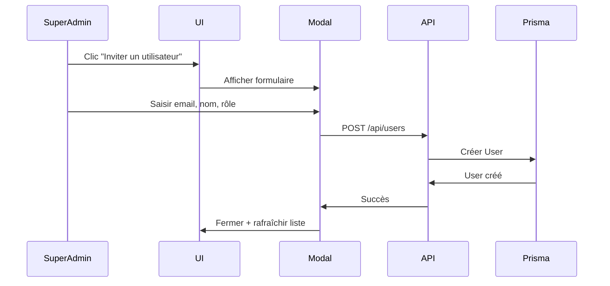
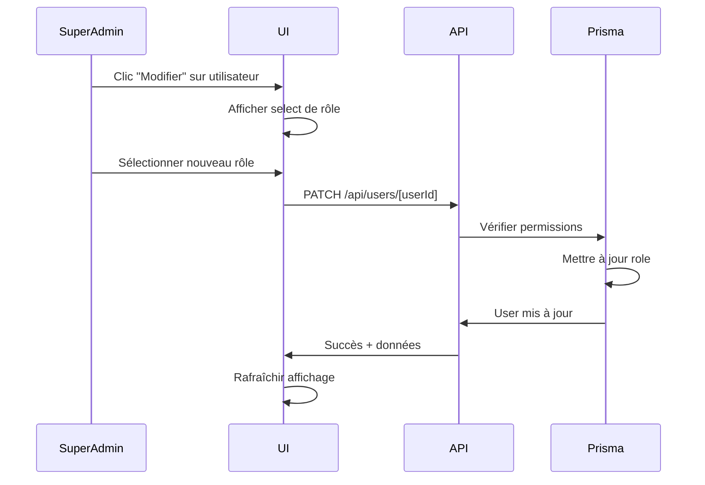
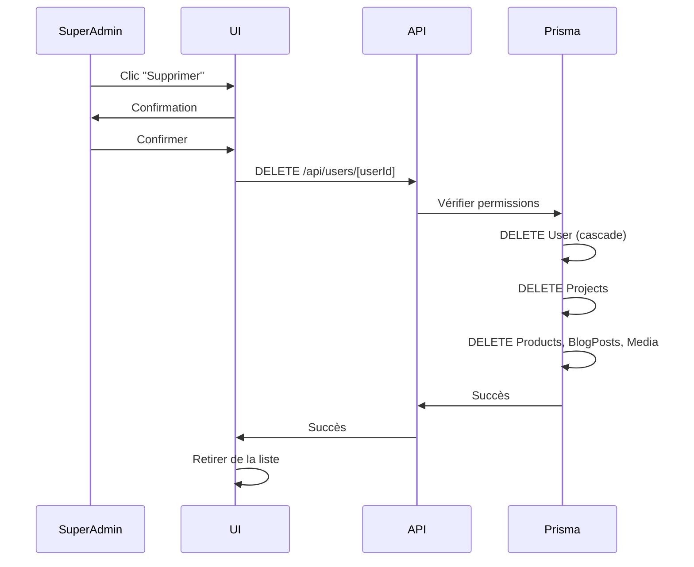

# Module de Gestion des Utilisateurs

## Vue d'ensemble

Le module de gestion des utilisateurs est intégré au système multi-tenant de Sifaka CMS. Il permet au **Super Admin** de gérer les utilisateurs, leurs rôles et leurs permissions dans le cadre de projets isolés.

## Architecture

### Hiérarchie des rôles

```
SUPER_ADMIN (Accès complet)
    ↓
ADMIN (Gestion de contenu)
    ↓
USER (Projets personnels)
```

### Permissions par rôle

| Fonctionnalité | USER | ADMIN | SUPER_ADMIN |
|----------------|------|-------|-------------|
| Créer ses projets | ✅ | ✅ | ✅ |
| Gérer ses projets | ✅ | ✅ | ✅ |
| Voir tous les projets | ❌ | ❌ | ✅ |
| Gérer les utilisateurs | ❌ | ❌ | ✅ |
| Modifier les rôles | ❌ | ❌ | ✅ |
| Supprimer des utilisateurs | ❌ | ❌ | ✅ |

## Intégration Multi-Tenant

### Relations Base de Données

```prisma
model User {
  id            String    @id @default(cuid())
  email         String?   @unique
  name          String?
  role          UserRole  @default(USER)
  
  // Relations multi-tenant
  projects      Project[] // Projets créés par l'utilisateur
  
  createdAt     DateTime  @default(now())
  updatedAt     DateTime  @updatedAt
}

model Project {
  id          String        @id @default(cuid())
  name        String
  slug        String        @unique
  ownerId     String
  
  // Relation avec l'utilisateur
  owner       User          @relation(fields: [ownerId], references: [id], onDelete: Cascade)
  
  // Contenu isolé par projet
  products    Product[]
  blogPosts   BlogPost[]
  media       Media[]
}
```

### Cascade de suppression

Lorsqu'un utilisateur est supprimé :
1. **Tous ses projets** sont supprimés (`onDelete: Cascade`)
2. **Tous les produits** de ces projets sont supprimés
3. **Tous les articles de blog** de ces projets sont supprimés
4. **Tous les médias** liés à ces projets sont supprimés

⚠️ **Attention** : La suppression d'un utilisateur est irréversible et entraîne la suppression de toutes ses données.

## Pages et Composants

### Pages

#### `/admin/users` - Liste des utilisateurs
- **Accès** : SUPER_ADMIN uniquement
- **Fonctionnalités** :
  - Liste paginée de tous les utilisateurs
  - Recherche par nom ou email
  - Filtrage par rôle
  - Statistiques (nombre par rôle)
  - Modification des rôles inline
  - Suppression d'utilisateurs
  - Invitation de nouveaux utilisateurs

#### `/admin/users/[userId]` - Profil utilisateur
- **Accès** : SUPER_ADMIN ou l'utilisateur lui-même
- **Fonctionnalités** :
  - Informations détaillées de l'utilisateur
  - Liste des projets de l'utilisateur
  - Statistiques (nombre de projets, date d'inscription)

### Composants

#### `InviteUserModal`
Modal pour inviter un nouvel utilisateur :
- Saisie de l'email (requis)
- Saisie du nom (optionnel)
- Sélection du rôle
- Descriptions des permissions par rôle

## API Routes

### `GET /api/users`
Liste tous les utilisateurs (SUPER_ADMIN uniquement)

**Réponse** :
```json
{
  "users": [
    {
      "id": "cuid",
      "name": "John Doe",
      "email": "john@example.com",
      "image": "https://...",
      "role": "USER",
      "createdAt": "2024-12-08T...",
      "updatedAt": "2024-12-08T...",
      "_count": {
        "projects": 3
      }
    }
  ]
}
```

### `POST /api/users`
Créer un nouvel utilisateur (invitation)

**Body** :
```json
{
  "email": "user@example.com",
  "name": "User Name",
  "role": "USER"
}
```

**Réponse** :
```json
{
  "user": {
    "id": "cuid",
    "email": "user@example.com",
    "name": "User Name",
    "role": "USER",
    ...
  }
}
```

### `GET /api/users/[userId]`
Récupérer un utilisateur avec ses projets

**Accès** : SUPER_ADMIN ou l'utilisateur lui-même

**Réponse** :
```json
{
  "user": {
    "id": "cuid",
    "name": "John Doe",
    "email": "john@example.com",
    "role": "USER",
    "projects": [
      {
        "id": "cuid",
        "name": "Mon Blog",
        "slug": "mon-blog",
        "type": "BLOG",
        "status": "ACTIVE"
      }
    ],
    "_count": {
      "projects": 1
    }
  }
}
```

### `PATCH /api/users/[userId]`
Mettre à jour un utilisateur

**Body** :
```json
{
  "name": "Nouveau nom",
  "role": "ADMIN"
}
```

**Restrictions** :
- Un utilisateur peut modifier son propre nom
- Seul SUPER_ADMIN peut modifier les rôles
- Le Super Admin principal (`fandresenar6@gmail.com`) ne peut pas être modifié par d'autres
- Un utilisateur ne peut pas changer son propre rôle

### `DELETE /api/users/[userId]`
Supprimer un utilisateur (SUPER_ADMIN uniquement)

**Restrictions** :
- Le Super Admin principal ne peut pas être supprimé
- Un utilisateur ne peut pas se supprimer lui-même
- Supprime tous les projets de l'utilisateur (cascade)

## Protections de Sécurité

### Super Admin Principal
Email hardcodé : `fandresenar6@gmail.com`

**Protections** :
1. ❌ Ne peut pas être supprimé
2. ❌ Son rôle ne peut pas être changé
3. ❌ Ne peut pas être modifié par d'autres admins
4. ✅ Peut se modifier lui-même (nom uniquement)
5. ✅ Auto-upgrade au login (via NextAuth callback)

### Validation des permissions

Toutes les routes API vérifient :
```typescript
// 1. Authentification
const session = await auth()
if (!session?.user?.id) {
  return NextResponse.json({ error: "Non autorisé" }, { status: 401 })
}

// 2. Autorisation
if (session.user.role !== "SUPER_ADMIN") {
  return NextResponse.json({ error: "Accès refusé" }, { status: 403 })
}

// 3. Protection du Super Admin principal
if (user.email === SUPER_ADMIN_EMAIL) {
  return NextResponse.json({ error: "Action interdite" }, { status: 403 })
}
```

## Flux d'utilisation

### 1. Inviter un utilisateur



### 2. Modifier un rôle



### 3. Supprimer un utilisateur



## Statistiques Dashboard

Le dashboard admin (`/admin/page.tsx`) affiche :

```tsx
<StatCard title="Utilisateurs" value={stats.users} change="+2 ce mois" />
<StatCard title="Admins" value={stats.admins} change="Stable" />
<StatCard title="Super Admins" value={stats.superAdmins} change="Stable" />
```

Les stats sont chargées depuis `/api/users` et filtrées par rôle.

## Migration depuis v0.1.x

Si vous migrez depuis une version antérieure :

1. **Pas de changement de schéma** - Le modèle `User` existait déjà
2. **Nouvelles routes API** - `/api/users` et `/api/users/[userId]`
3. **Nouveau composant** - `InviteUserModal`
4. **Page mise à jour** - `/admin/users` maintenant fonctionnelle

### Vérifier les données existantes

```bash
cd apps/web
npx tsx scripts/check-users.ts
```

Ce script affiche tous les utilisateurs en base de données.

## Tests

### Test manuel

1. Connectez-vous en tant que Super Admin
2. Allez sur `/admin/users`
3. Testez :
   - ✅ Liste des utilisateurs chargée
   - ✅ Recherche par email
   - ✅ Filtrage par rôle
   - ✅ Invitation d'un utilisateur
   - ✅ Modification de rôle
   - ✅ Affichage des projets par utilisateur
   - ✅ Protection du Super Admin principal

### Test des permissions

| Action | USER | ADMIN | SUPER_ADMIN |
|--------|------|-------|-------------|
| Accéder à `/admin/users` | ❌ 403 | ❌ 403 | ✅ 200 |
| GET `/api/users` | ❌ 403 | ❌ 403 | ✅ 200 |
| POST `/api/users` | ❌ 403 | ❌ 403 | ✅ 201 |
| PATCH `/api/users/[id]` (own) | ✅ 200 (name only) | ✅ 200 (name only) | ✅ 200 (all) |
| PATCH `/api/users/[id]` (other) | ❌ 403 | ❌ 403 | ✅ 200 |
| DELETE `/api/users/[id]` | ❌ 403 | ❌ 403 | ✅ 200 |

## Améliorations futures

### Version 0.3.0 (prévue)
- [ ] Système d'invitation par email
- [ ] Gestion des permissions granulaires par projet
- [ ] Rôles personnalisés
- [ ] Audit log des actions admin
- [ ] Recherche avancée avec filtres multiples

### Version 0.4.0 (prévue)
- [ ] API REST complète pour utilisateurs
- [ ] Webhooks sur création/suppression d'utilisateur
- [ ] Export CSV des utilisateurs
- [ ] Statistiques d'utilisation par utilisateur

## Support

Pour toute question ou problème :
1. Vérifier la documentation dans `/apps/web/README.md`
2. Consulter les logs API dans la console
3. Vérifier les permissions dans Prisma Studio

---

**Version** : 0.2.0  
**Dernière mise à jour** : 8 décembre 2024  
**Auteur** : Sifaka CMS Team
